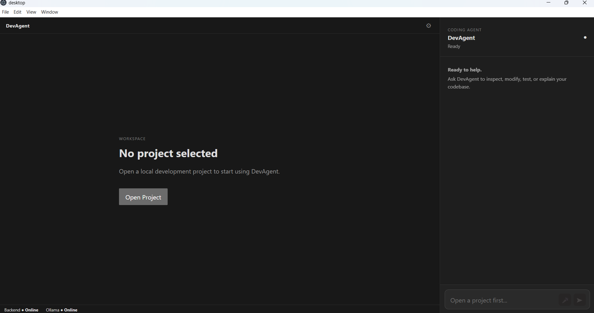
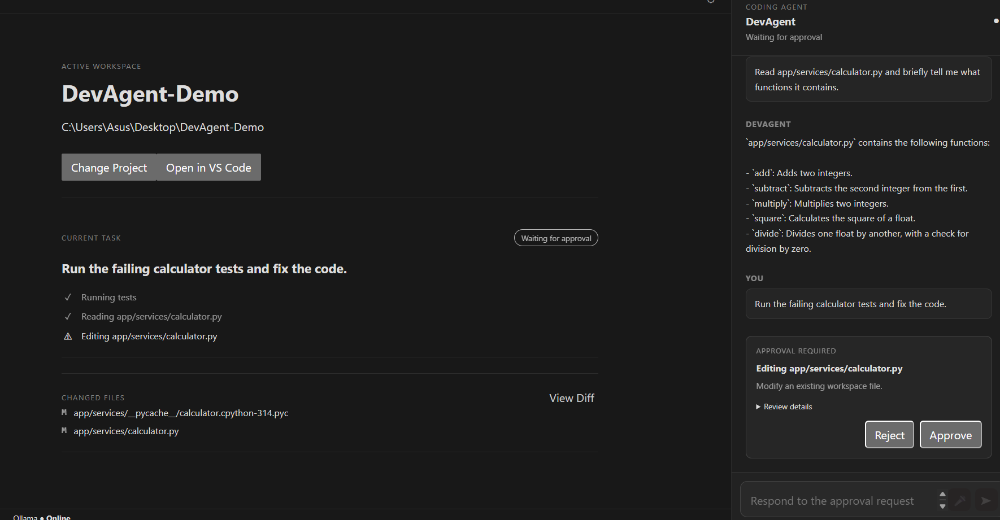
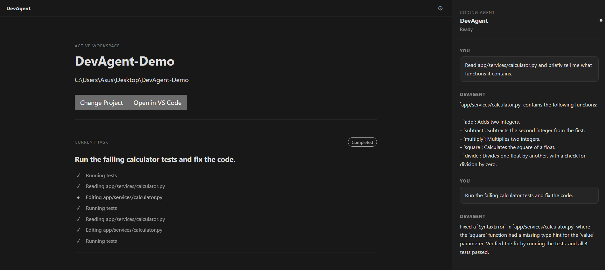
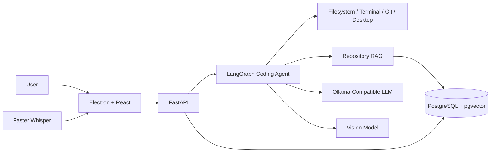

# DevAgent

**DevAgent is a local-first agentic AI coding assistant that can understand
repositories, retrieve relevant code, plan changes, safely edit files,
execute tests, debug failures, use Git, remember workspace context, and
recover interrupted tasks.**

Built with **LangGraph, LangChain, FastAPI, PostgreSQL, pgvector,
Ollama-compatible LLMs, Electron, React, vision models, and Faster Whisper.**

## Why I Built It

DevAgent explores how production-style AI agents can combine:

- LLM reasoning and tool calling
- Repository RAG
- Autonomous debugging
- Human-in-the-loop approvals
- Persistent memory and checkpoints
- Execution guardrails
- Vision fallback
- Voice input
- Real-time agent streaming
- Evaluation-driven development

## Key AI Capabilities

### Agentic Coding Workflow

DevAgent uses a LangGraph-based coding agent that can inspect a repository,
choose tools, modify code with approval, run tests, analyze failures, and
continue debugging until the task succeeds or an execution guardrail stops it.

Typical workflow:

```text
User Request
    ↓
Repository Search / RAG
    ↓
Read Relevant Code
    ↓
Choose Tools
    ↓
Human Approval if Required
    ↓
Edit Code
    ↓
Run Tests
    ↓
Analyze Failures
    ↓
Self-Correct
    ↓
Git Diff
    ↓
Final Response
```

### Repository RAG

DevAgent builds semantic knowledge of the active repository using:

- AST-aware Python chunking
- Generic text chunking
- Embeddings
- PostgreSQL
- pgvector similarity search
- Incremental indexing using file hashes

This allows the agent to find relevant code even when the user does not know
the exact filename or function name.

### Tool Calling

DevAgent can use tools for:

- Reading and searching files
- Exact source-text search
- Semantic repository search
- Creating and editing files
- Running pytest
- Safe terminal execution
- Git status and diff inspection
- Opening workspace paths and URLs
- Screen analysis when visual information is required

DevAgent follows the principle:

> **Direct system tools first, vision only when necessary.**

### Autonomous Debugging

DevAgent can identify a bug, propose an edit, request approval, run tests,
inspect failures, modify the implementation, and rerun tests until the task
succeeds or a configured execution limit is reached.

---

## Human-in-the-Loop Safety

Sensitive actions are protected by explicit approval.

Safe repository-reading operations can execute automatically, while actions
such as:

- Code modification
- Desktop actions
- Screen observation

require user approval.

LangGraph interrupts pause execution before sensitive tools run and resume the
same task after approval.

Rejected actions terminate cleanly without repeatedly retrying the same edit.

---

## Persistent Memory and Recovery

DevAgent stores workspace-specific state using PostgreSQL.

It supports:

- Persistent workspace memory
- Persistent conversation history
- Agent task history
- Audit events
- PostgreSQL-backed LangGraph checkpoints
- Recovery after backend restart

A task waiting for approval can survive a backend restart and continue from
the same LangGraph thread.

---

## Vision and Voice

### Vision

DevAgent uses a vision model only when information exists visually and cannot
be obtained more reliably through filesystem, Git, terminal, or API tools.

Screen analysis requires explicit approval.

### Voice

Voice commands are transcribed using Faster Whisper.

```text
Microphone
    ↓
Audio Recording
    ↓
Whisper Transcription
    ↓
Editable Prompt
    ↓
User Sends Command
```

The transcription is not automatically executed, allowing the user to review
or correct it first.

---

## Real-Time Agent Streaming

The FastAPI backend streams agent events to the Electron desktop application.

The UI can display:

- Tool requested
- Tool completed
- Approval required
- Agent response
- Task completed
- Errors

Execution activity is separated from the conversation so the user can inspect
what the agent is doing without filling the chat with raw tool output.

---

## Evaluation

DevAgent includes a dedicated evaluation harness for measuring agent behavior.

### Automated Evaluation

The evaluated v1.0.0 configuration passed:

- **5 / 5 automated evaluation cases**
- **100% pass rate in the defined automated suite**
- **1.70 seconds median automated task latency**

The automated suite covers:

- Repository understanding
- Semantic repository retrieval
- Exact source-text search
- Tool selection
- Test execution
- Avoiding vision when direct tools are available

### Manual End-to-End Evaluation

DevAgent also passed:

- **10 / 10 manual evaluation scenarios**

The manual evaluation covers:

- Human approval before writes
- Approval rejection
- Autonomous debugging
- Restart recovery
- Persistent conversation history
- Guardrail enforcement
- Vision fallback
- Desktop action approval
- Voice input
- Git diff integration

These results apply to the defined DevAgent evaluation suite and test
workspace and are not intended as general AI accuracy guarantees.

[View the full evaluation report](backend/evals/final_report.md)

---

## Screenshots

### DevAgent Workspace



### Human-in-the-Loop Approval



### Autonomous Task



---

## Architecture



---

## Tech Stack

### Agentic AI

- LangGraph
- LangChain
- Ollama-compatible LLMs
- Tool calling
- Human-in-the-loop interrupts
- Persistent checkpoints

### RAG and Data

- Repository indexing
- AST-aware chunking
- Embeddings
- PostgreSQL
- pgvector
- SQLAlchemy

### Backend

- Python
- FastAPI
- Pydantic
- Uvicorn
- httpx

### Multimodal AI

- Faster Whisper
- Vision model

### Desktop

- Electron
- React
- TypeScript
- Vite

### Developer Tooling

- Git
- pytest
- VS Code CLI
- PyInstaller
- Electron Builder

---

## Project Structure

```text
DevAgent/
├── backend/
│   ├── app/
│   │   ├── agents/
│   │   ├── api/
│   │   ├── memory/
│   │   ├── repository/
│   │   ├── security/
│   │   ├── tools/
│   │   └── workspace/
│   │
│   ├── evals/
│   ├── backend_entry.py
│   ├── requirements.txt
│   └── .env.example
│
├── desktop/
│   ├── electron/
│   ├── src/
│   └── package.json
│
├── docs/
│   └── screenshots/
│
└── README.md
```

---

## Development Setup

### Requirements

- Windows 10/11
- Python
- Node.js
- PostgreSQL with pgvector
- Git
- Ollama or another compatible model endpoint

### Backend

```powershell
cd backend

python -m venv .venv

.venv\Scripts\activate

pip install -r requirements.txt

Copy-Item .env.example .env
```

Configure `.env`, then run:

```powershell
python backend_entry.py
```

### Desktop

```powershell
cd desktop

npm install

npm run dev
```

---

## Windows Release

DevAgent can be packaged as a Windows desktop application containing the
Electron frontend and bundled FastAPI backend.

Build the backend:

```powershell
cd backend

pyinstaller --noconfirm --clean --onedir --name devagent-backend backend_entry.py
```

Build the Windows installer:

```powershell
cd ../desktop

npm run dist
```

Production configuration is loaded from:

```text
%APPDATA%\DevAgent\.env
```

The current release requires a configured PostgreSQL/pgvector database and an
Ollama-compatible model endpoint.

---

## Current Limitations

- Currently focused on Windows.
- PostgreSQL/pgvector must be configured separately.
- A compatible model endpoint is required.
- The Windows installer is currently unsigned.
- The current evaluation suite uses a controlled test repository.
- DevAgent is designed for developer-controlled local repositories rather
  than unrestricted autonomous execution.

---

## Future Work

- Larger multi-repository evaluation suites
- Support for additional language-aware chunkers
- Automated regression benchmarks
- Additional model providers
- Sandboxed execution
- Team/shared memory
- Improved Git diff visualization
- Extensible tool/plugin system
